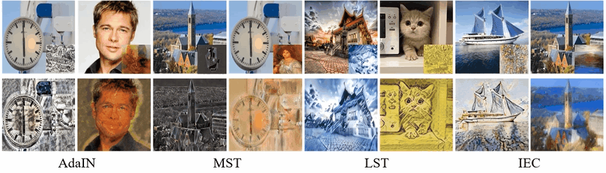
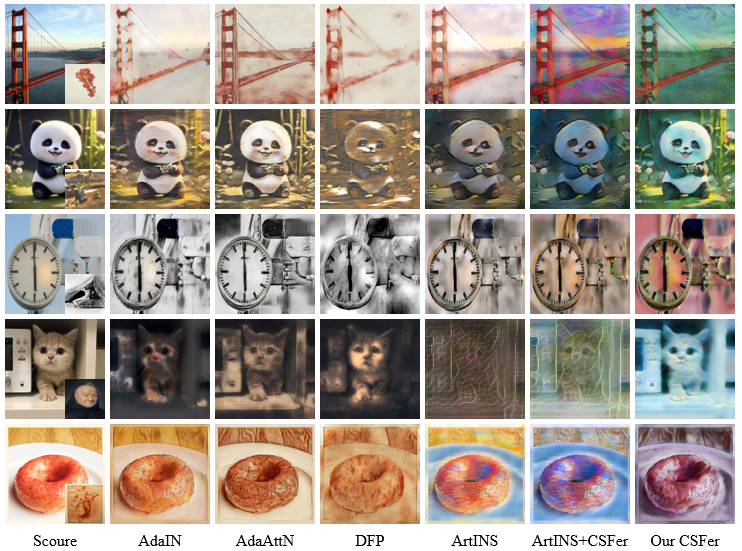
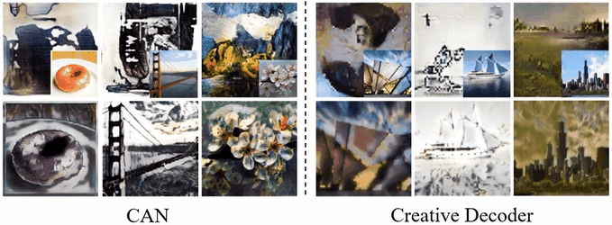

# Creative Style Transfer for Image Stylization via Learning Neural Permutation

## Visualizations

- **Generalization results using our CSFer to insert into the LST, MST and IEC methods**

  

- **More results by style transfer in comparison with AdaIN,**
  **AdaAttN, DFP and ArtINS**

  

- **Generated by CAN, Creative Decoder, and our CSFer method**

## code

coming soon
